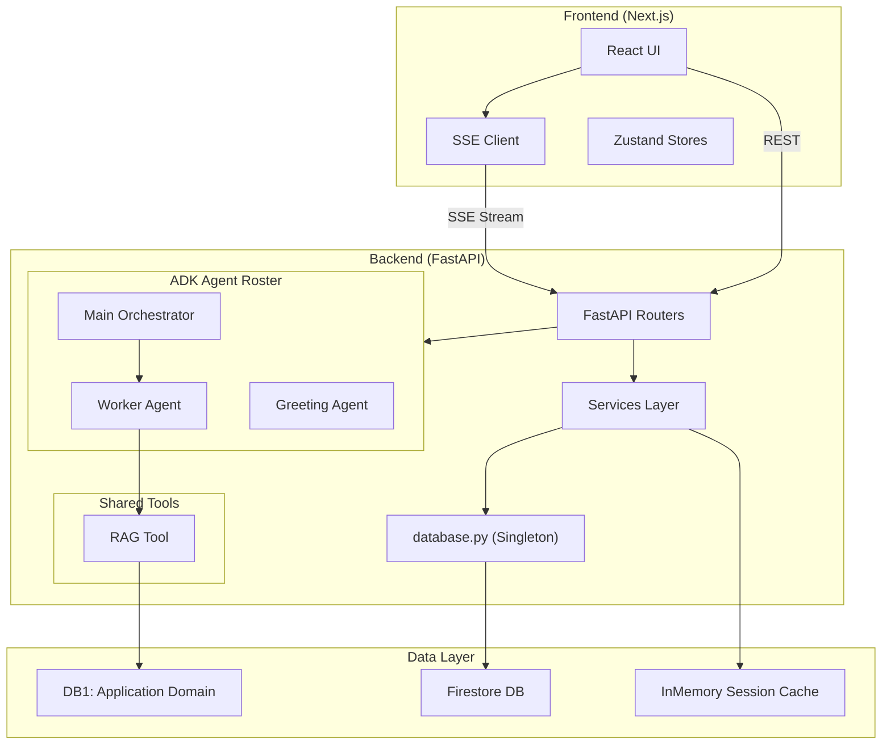
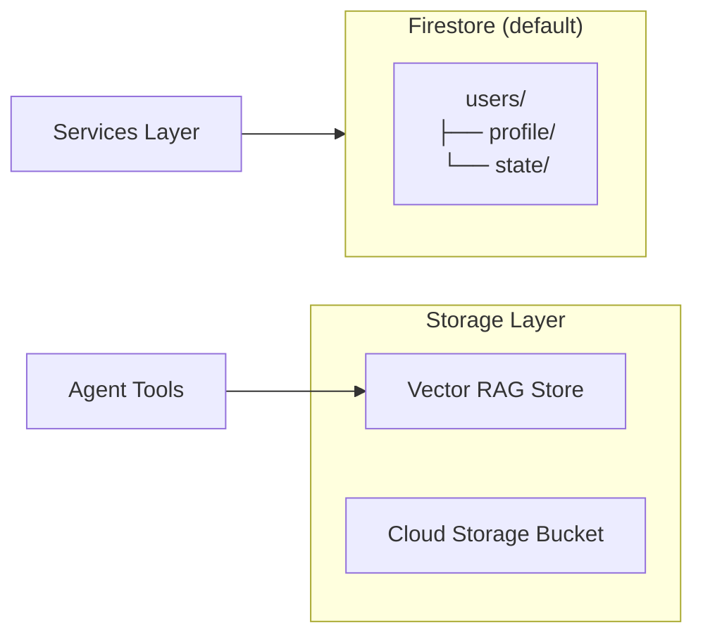

# {{PROJECT_NAME}} — Complete Workspace Guide

> **Purpose:** A comprehensive, agent-handoff-ready guide to the {{PROJECT_NAME}} workspace. Detailed enough for a new agent or developer to clone, understand, and operate the full system from zero.

---

## 1. What This Project Is

**{{PROJECT_NAME}}** is an AI-powered application built on the Clean Optimized BMAD Workspace template. It uses Google's Agent Development Kit (ADK) to orchestrate multiple specialized AI agents. This workspace serves as a pristine, project-agnostic foundation that includes a standardized tech stack, the BMAD development engine, and the CCPS (Context Collapse Prevention System).

---

## 2. Tech Stack

| Layer | Technology | Details |
|---|---|---|
| **Frontend** | Next.js 16+ (React/TypeScript) | `frontend/` directory, App Router |
| **Backend** | Python 3.13+ / FastAPI | `backend/` directory, async |
| **AI Agents** | Google ADK (Agent Development Kit) | Multi-agent orchestration |
| **LLMs** | Gemini 3.1 Flash + Gemini 3.1 Pro | Fast streaming vs. deep reasoning |
| **RAG** | Vector Search / Vertex AI | Primary Knowledge Bases |
| **Database** | Cloud Firestore | User profiles, state, logs (Default configured) |
| **Auth** | Firebase Auth | Identity & token validation |
| **Storage** | Firebase Storage | Static assets and documents |
| **Dev Agent** | Google Antigravity | `.agent/` config (rules, skills, workflows) |
| **Dev Method** | BMAD (Business Mastery & Agile Development) | Story-driven sprint workflow |

---

## 3. Project Architecture Diagram



---

## 4. Directory Structure

### Root Level
```text
{{PROJECT_NAME}}/
├── .agent/                    # 🧠 Antigravity Agent Config (THIS GUIDE)
│   ├── gemini.md              # Project constitution — routing table
│   ├── README.md              # Agent directory overview
│   ├── rules/                 # CCPS & Constraint files (Always On + Model Decision)
│   ├── skills/                # Developer skill packs (BMAD, Firebase, etc.)
│   └── workflows/             # Slash commands (/1_ccps_boot-context)
│
├── _bmad/                     # BMAD Method templates (reusable, not project-specific)
├── _bmad-output/              # 📋 BMAD Output (Source of Truth)
│   ├── planning-artifacts/    # PRD, Architecture, Epics, UX Design
│   ├── component-specs/       # CCPS component specs
│   ├── active-context/        # Session continuity state
│   ├── implementation-artifacts/  # Story files, sprint status
│   ├── test-artifacts/        # Test reports
│   └── project-context.md     # Auto-loaded context for all workflows
│
├── backend/                   # 🐍 Python Backend (FastAPI + ADK)
├── frontend/                  # ⚛️ Next.js Frontend
├── scripts/                   # Utility scripts
├── docs/                      # General documentation (e.g. tech-stack.md)
├── firebase.json              # Firebase project config
├── firestore.rules            # Security rules (Deny-All by default)
├── .antigravity/              # IDE configs (mcp.json)
└── pyproject.toml             # Python project config
```

### Backend Structure (Example)
```text
backend/
├── main.py                    # FastAPI app, CORS, routers
├── agent.py                   # Root ADK agent
├── database.py                # ⚠️ SINGLETON — all Firestore access
├── models.py                  # Pydantic data models
│
├── agents/                    # 🤖 ADK Agent Visual Containment
│   └── example_agent/
│       ├── agent.py
│       └── prompts.py
│
├── routers/                   # 🛣️ FastAPI Routers (1 per domain)
├── services/                  # 📦 Business Logic Layer
├── tools/                     # 🔧 Shared Deterministic Tools
├── schemas/                   # Pydantic request/response schemas
├── tests/                     # pytest test suite
└── requirements.txt           # Python dependencies
```

---

## 5. Agent Config System (`.agent/`)

### How It Works

The `.agent/` directory is the **brain** of the development agent. When Antigravity starts a session, it loads:
1. **`gemini.md`** (Always) — Project routing table, agent roster.
2. **`rules/`** (Selective) — Constraints loaded based on `activation:` frontmatter (CCPS Rules).
3. **`skills/`** (On Demand) — Deep expertise loaded only when task matches skill description.
4. **`workflows/`** (Invoked) — Slash commands triggered by user (`/workflow-name`).

### CCPS Rules Inventory

| File | Activation | Purpose |
|---|---|---|
| `constitution.md` | **Always On** | 🚫 Never / ⚠️ Ask First / ✅ Always behavioral boundaries |
| `code-standards.md` | **Always On** | Custom stack coding conventions |
| `component-spec-compliance.md` | Model Decision | CCPS pre-implementation spec check |
| `dependency-awareness.md` | Model Decision | Package change guardrails |
| `post-implementation-learning.md` | Model Decision | CCPS post-fix refinement loop |
| `agent-context-protocol.md` | Model Decision | System specific protocols |
| `prompt-tdd.md` | Model Decision | Enforces prompt TDD unit-testing on builders |
| `voice-agent-architecture.md` | Model Decision | Real-time voice agent and WebSocket guidelines |
| `completion-not-illusion.md` | Model Decision | A polished artifact is not a finished story — mark incompleteness loudly (used by the `/autopilot` loop) |
| `mermaid-diagram-preferences.md` | Model Decision | Use `flowchart` over `sequenceDiagram` — diagram register guidance |

### Installed Agent Skills (`.agent/skills/`)

With over 65 pre-installed skills, the workspace comes ready with deep domain expertise:

| Category | Key Active Skills | Count |
|---|---|---|
| **BMAD Personas** | `bmad-agent-architect`, `bmad-agent-dev`, `bmad-agent-pm`, `bmad-agent-qa`, `bmad-agent-sm` | 10+ |
| **BMAD Engine** | `bmad-create-prd`, `bmad-dev-story`, `bmad-sprint-planning`, `bmad-technical-research` | 40+ |
| **Firebase & GCP** | `firebase-auth-basics`, `firebase-firestore-basics`, `gcp-cloud-run`, `troubleshoot-cloudrun-deployment` | 10 |
| **Code Standards** | `react-best-practices`, `python-patterns`, `systematic-debugging`, `ui-ux-pro-max`, `voice-ai-development`, `sse-streaming-patterns`, `adk_skills` | 8 |

> **Note:** For a complete manifest of all 65+ skills, refer to `docs/skills-registry.md`.

### Installed MCP Plugins

| Plugin Server | Purpose | Config Location |
|---|---|---|
| **Firebase MCP** | Direct IDE integration with Firestore, Storage, and Auth | `.antigravity/mcp.json` |
| **Cloud Run MCP** | Direct IDE integration for GCP deployments | Native ADK |

---

## 6. CCPS — Context Collapse Prevention System

The CCPS is a 3-phase workflow that prevents the agent from losing context during long sessions:

```mermaid
graph TD
    START["Session Start"] --> BOOT["/1_ccps_boot-context"]
    BOOT --> |"Load active-context.md"| WORK["Development Work"]
    WORK --> |"Before modifying component"| SPEC["component-spec-compliance rule"]
    SPEC --> |"Read component spec, check invariants"| WORK
    WORK --> |"After bug fix"| POST["post-implementation-learning rule"]
    POST --> |"Ask about spec updates + refinement loop"| SAVE
    WORK --> |"Session ending"| SAVE["/1_ccps_update-active-context"]
    SAVE --> |"Save tasks, learnings, prune stale"| END["Session End"]

    style BOOT fill:#2d6a4f
    style SPEC fill:#e76f51
    style POST fill:#264653
    style SAVE fill:#2d6a4f
```



---

## 7. BMAD Method — The Development Engine

BMAD (BMad Mastery Development Method) is the development methodology that drives all work on this project. It is **mandatory** for generating features, planning epics, and executing code changes.

### Two Directories, Two Purposes

| Directory | What | Reusable? |
|---|---|---|
| `_bmad/` | **The engine** — templates, workflow scripts, agent definitions, config | ✅ Project-agnostic |
| `_bmad-output/` | **The output** — PRD, Architecture, stories, sprint status | ❌ Project-specific |

### The 4 Phases

| Phase | Produces | Key Commands |
|---|---|---|
| **1. Analysis** | Product Brief | `/bmad-bmm-create-product-brief`, `/bmad-bmm-domain-research` |
| **2. Planning** | PRD, UX Design | `/bmad-bmm-create-prd`, `/bmad-bmm-create-ux-design` |
| **3. Solutioning** | Architecture, Epics | `/bmad-bmm-create-architecture`, `/bmad-bmm-create-epics-and-stories` |
| **4. Implementation** | Working Code | `/bmad-bmm-create-story`, `/bmad-bmm-dev-story`, `/bmad-bmm-sprint-status` |

### BMAD Agent Personas

| Agent | Name | Expertise | Summon |
|---|---|---|---|
| 🔍 Analyst | Mary | Requirements discovery | "Talk to Mary" |
| 📋 PM | John | PRD creation, feature prioritization | "Talk to John" |
| 🎨 UX Designer | Sally | UI patterns, interaction design | "Talk to Sally" |
| 🏗️ Architect | Winston | System design, API contracts | "Talk to Winston" |
| 📊 Scrum Master | Bob | Sprint planning, backlog grooming | "Talk to Bob" |
| 👩‍💻 Developer | Amelia | Story implementation, code execution | "Talk to Amelia" |
| 🧪 QA Engineer | Quinn | Test automation | "Talk to Quinn" |

---

## 8. Database Topology (Generic Example)



---

## 9. How to Bootstrap a New Project

Because you are inside the **Clean Optimized BMAD Workspace**, starting a new project is automated:

1. **Copy the entire workspace directory** to your new project location.
2. **Execute a global Find and Replace:**
   - Search: `{{PROJECT_NAME}}` -> Replace: `<Your Project Name>`
3. **Install Dependencies:**
   - Backend: `python -m venv .venv` → `pip install -r backend/requirements.txt`
   - Frontend: `npm install`
4. **Boot BMAD Analysis:**
   - Run `/bmad-bmm-create-product-brief` to generate Phase 1.
5. **Adjust `firestore.rules` and `.antigravity/mcp.json`** to reflect your GCP Target infrastructure.

---

## 10. Common Operations

### Starting a Session
```bash
/1_ccps_boot-context
```

### Restarting Dev Environment
```bash
/1_run-restart-dev-env
```

### Creating & Developing a Story
```bash
/bmad-bmm-create-story
/bmad-bmm-dev-story
```

### Ending a Session
```bash
/1_ccps_update-active-context
```
