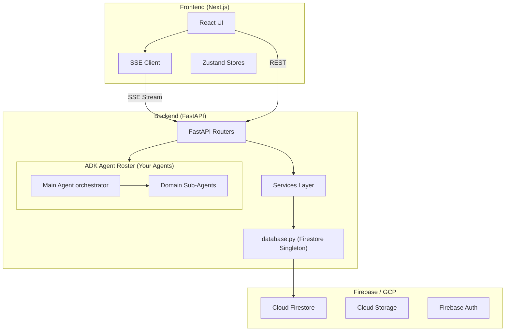
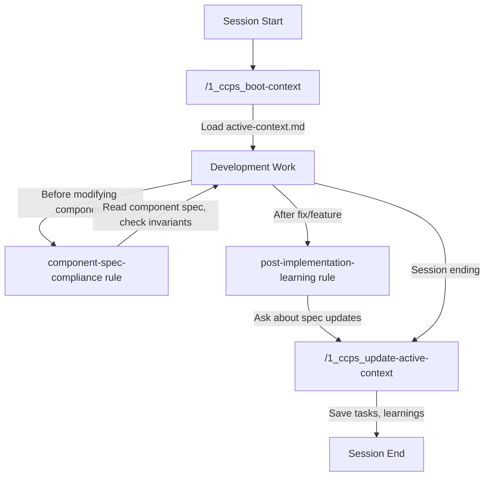

# Clean Optimized BMAD Workspace — Complete Guide

> **Purpose:** A comprehensive, agent-handoff-ready guide to the clean BMAD workspace template. Detailed enough for a new agent or developer to clone, understand, and operate the full system from zero on any new project.

---

## 1. What This Project Is

The **Clean Optimized BMAD Workspace** is a production-ready, highly opinionated boilerplate for AI-assisted software development using the Google Agent Development Kit (ADK) and the BMAD (Business Mastery & Agile Development) methodology.

It provides a pre-scaffolded Next.js frontend, FastAPI backend, full CCPS (Context Collapse Prevention System), and 25+ pre-installed GitHub agent skills. It contains **zero project-specific logic or domain constraints**, serving as the pristine starting point for all new AGY projects.

---

## 2. Tech Stack Overview

*(For deep details and exact versions, see `docs/tech-stack.md`)*

| Layer | Technology | Details |
|---|---|---|
| **Frontend** | Next.js 16+ (React/TypeScript) | `frontend/` directory, App Router |
| **Backend** | Python 3.13+ / FastAPI | `backend/` directory, async |
| **AI Agents** | Google ADK (Agent Development Kit) | Multi-agent orchestration |
| **LLMs** | Gemini 3.1 Flash / Gemini 3.1 Pro | Fast streaming vs. deep reasoning |
| **Database** | Cloud Firestore | Configured via `firebase.json` |
| **Cloud** | Google Cloud / Firebase | Auth, Firestore, Storage |
| **Dev Agent** | Google Antigravity | `.agent/` config (rules, skills, workflows) |
| **Dev Method** | BMAD (Business Mastery & Agile Development) | Story-driven sprint workflow (`_bmad/`) |

---

## 3. Project Architecture Diagram (Generic)



---

## 4. Directory Structure

### Root Level
```text
clean-bmad-workspace/
├── .agent/                    # 🧠 Antigravity Agent Config (Rules, Workflows, Local Skills)
├── .agents/skills/            # 📦 Pre-installed GitHub Skills (25+ from Google/Firebase)
├── _01_My/                    # Personal scratches, diagrams, reference material (like this guide)
├── _02_workspace_chats/       # Archived chat logs
├── _bmad/                     # BMAD Method templates (reusable engine)
├── _bmad-output/              # 📋 BMAD Output (Source of Truth - PRDs, Sprints, Specs)
├── backend/                   # 🐍 Python Backend (Scaffolded with __init__.py)
├── docs/                      # General documentation (tech-stack.md, skills-registry.md)
├── frontend/                  # ⚛️ Next.js Frontend (Scaffolded)
├── scripts/                   # Utility scripts
├── firebase.json              # Firebase project config
├── firestore.rules            # Security rules (Deny-All by default)
├── storage.rules              # Storage rules (Deny-All by default)
├── .env.example               # Template for environment variables
├── pyproject.toml             # Python project config
└── conftest.py                # Root pytest config (path resolution)
```

### Backend Structure
```text
backend/
├── __init__.py
├── agents/                    # 🤖 ADK Agent Visual Containment
├── routers/                   # 🛣️ FastAPI Routers
├── schemas/                   # Pydantic models
├── services/                  # 📦 Business Logic
└── tools/                     # Shared agent tools
```

---

## 5. Agent Config System (`.agent/` & `.agents/skills/`)

### How It Works

1. **`gemini.md`** (Always) — Project constitution, routing table, general heuristics.
2. **`rules/`** (Selective) — Constraints loaded based on context (e.g., ADK formatting, CCPS rules).
3. **`.agents/skills/`** (Global) — 25+ pre-installed skills from Google/Firebase GitHub repositories.
4. **`workflows/`** (Invoked) — Slash commands triggered by user (`/workflow-name`).

### Pre-Installed GitHub Skills
25 skills are pre-installed in `.agents/skills/` to provide immediate domain expertise:
- **`firebase/agent-skills`** (11 skills): Auth, Firestore, Hosting, Storage, Functions.
- **`google-gemini/gemini-skills`** (4 skills): Gemini API Dev, Interactions, Live API.
- **`cnemri/google-genai-skills`** (10 skills): GenAI SDK, Google Developer Knowledge, Deep Research.

### Rules Inventory (10 files)
- `constitution.md`: Behavioral boundaries (Never/Ask/Always).
- `code-standards.md`: TypeScript/Python/CSS conventions.
- `adk_file_formating.md`: ADK visual containment architecture.
- `component-spec-compliance.md` & `post-implementation-learning.md`: Core CCPS rules.
- `server-restart.md`: Defines application restart routines.

---

## 6. CCPS — Context Collapse Prevention System

The CCPS protects the agent from losing context during complex, multi-day sessions.



---

## 7. BMAD Method — The Development Engine

BMAD (Business Mastery & Agile Development) drives all work. Every feature, bug fix, and refactor flows through BMAD.

| Directory | What | Reusable? |
|---|---|---|
| `_bmad/` | **The engine** — templates, workflow scripts, agent definitions. | ✅ Project-agnostic. |
| `_bmad-output/` | **The output** — PRD, Architecture, stories, specs. | ❌ Project-specific (Empty by default). |

### The 4 Phases

| Phase | Produces | Key Commands |
|---|---|---|
| **1. Analysis** | Product Brief | `/bmad-bmm-create-product-brief`, `/bmad-bmm-domain-research` |
| **2. Planning** | PRD, UX Design | `/bmad-bmm-create-prd`, `/bmad-bmm-create-ux-design` |
| **3. Solutioning** | Architecture, Epics | `/bmad-bmm-create-architecture`, `/bmad-bmm-create-epics-and-stories` |
| **4. Implementation** | Working Code | `/bmad-bmm-create-story`, `/bmad-bmm-dev-story`, `/bmad-bmm-sprint-status` |

---

## 8. How to Use for a New Project

To spin up a new project based on this workspace:

1. **Copy the Entire Directory** to your new project path.
2. **Find and Replace Placeholders**:
   - Search for `{{PROJECT_NAME}}` (e.g., in `.env.example`, `_bmad/`, `README.md`) and replace it with your project's name.
   - Search for `{{PROJECT_DESCRIPTION}}` and replace it.
   - Search for `{{USER_NAME}}` and replace it with your name.
   - Search for `{{PROJECT_PATH}}` (in `.agent/rules/server-restart.md`) and replace it with the absolute path of the new project.
3. **Initialize the Environment**:
   - Create Python `.venv` and install `backend/requirements.txt` (see `docs/tech-stack.md`).
   - Run `npm install` in `frontend/`.
4. **Update Firebase/GCP Configs**:
   - Create Firebase project, insert `use <projectId>` or `.firebaserc`.
   - Update `firebase.json` as your infrastructure scales.
5. **Start Phase 1**:
   - Run `/bmad-bmm-create-product-brief` to begin discovering the new app!

---

## 9. Common Operations

### Starting a Session
```bash
/1_ccps_boot-context
```

### Restarting Dev Environment
```bash
/1_run-restart-dev-env
```

### Running Tests
```bash
/1_run-all-tests-back_front
```

### Emergency Tech Spec (Bug Fix)
```bash
/quick-spec
```

### Ending a Session
```bash
/1_ccps_update-active-context
```
